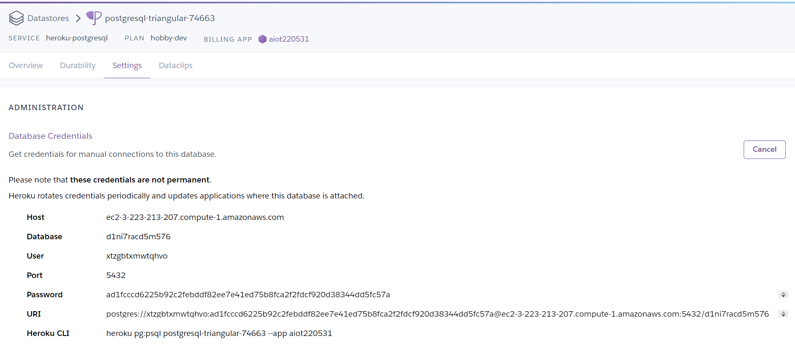

# AIoT Github

## Lecture 15: IoT Flask Web (deploy to heroku)
#### Author: Vicky Chen 


### step 0：register and download
 * 註冊Heroku, github
 * 下載HeidiSQL, VS code


### step 1 : Clone this github
* git clone https://github.com/huanchen1107/aiot0530-start-no-token 到 local\aiot220531 folder
* 把local的 \aiot220531\ .git 殺掉 (產生自己的git管理員) 方便建立新的git repository 
* 推送至github建立新的aiot220531 (https://github.com/vickychen928/aiot220531)

### step 2 : install some package
```python
pip install gunicorn Flask==2.0.1 Jinja2==3.0.1 psycopg2 sklearn pandas numpy 
```

### step 3: add an heroku postgredb
* register heroku account
* go to dashboard
* new an app
* go to resource and add-on an Heroku postgredb


### step 4: login to heroku postgredb using HeidiSQL
* 在app.py改成用heroku postgredb
```sql
myserver ="<fill-in-Heroku-Postgredb-DB-sever>"
myuser="<fill-in-Heroku-Postgredb-DB-user>"
mypassword="<fill-in-Heroku-Postgredb-DB-pwd>"
mydb="<fill-in-Heroku-Postgredb-DB-db>"
```

* 查看剛剛建立的heroku postgredb的Credentials\
(dashboard點擊resource --> 剛剛建立好的heroku postgredb --> Settings --> View Credentials...)



* 使用hedisql輸入上面的資料庫資訊連接heroku postgredb


### step 5: import postgredb (in db/postgre.db)
* 選擇public資料庫，接下來點擊左上方檔案 --> 載入SQL檔案 --> 匯入postgre.db (檔案在db/postgre.db)


### step 6: setting db in app.py
* 將app.py中資料庫的資訊換成heroku postgredb的資訊 (角括號不用留)
```sql
myserver ="<fill-in-Heroku-Postgredb-DB-sever>"  #myserver ="ec2-3-223-213-207.compute-1.amazonaws.com"
myuser="<fill-in-Heroku-Postgredb-DB-user>"      #myuser="xtzgbtxmwtqhvo"
mypassword="<fill-in-Heroku-Postgredb-DB-pwd>"   #mypassword="ad1fcccd6225b92c2febddf82ee7e41ed75b8fca2f2fdcf920d38344dd5fc57a"
mydb="<fill-in-Heroku-Postgredb-DB-db>"          #mydb="d1ni7racd5m576"
```


### step 7: testing locally by running python app.py
* `ctrl` + ``\` 呼叫終端機，並輸入python app.py執行程式


### step 8: deploy to github (new public github repositoy 不然看不到)
delete .git and git remote add origin master github.com/xxxxx


### step 9: Heroku deploy from github
* dashboard點擊deploys --> Deployment method選擇github --> Enable Automatic Deploys --> Manual deploy點擊Deploy branch
* 產生的網站: https://aiot220531.herokuapp.com/ \
(aiot220531是step 3建立的Heroku app名稱)


### step 10: Complete

Sample link 1:
https://awinlab-aiot.herokuapp.com/

Sample link 2: 
https://aiot0529.herokuapp.com/

my link: https://aiot220531.herokuapp.com/ 


